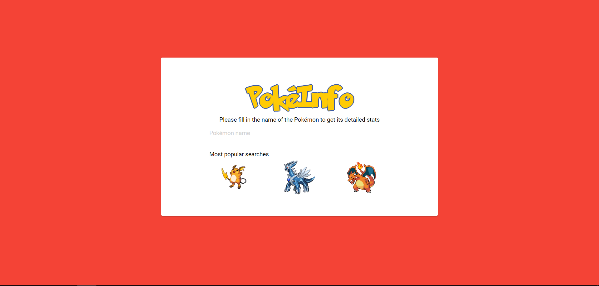
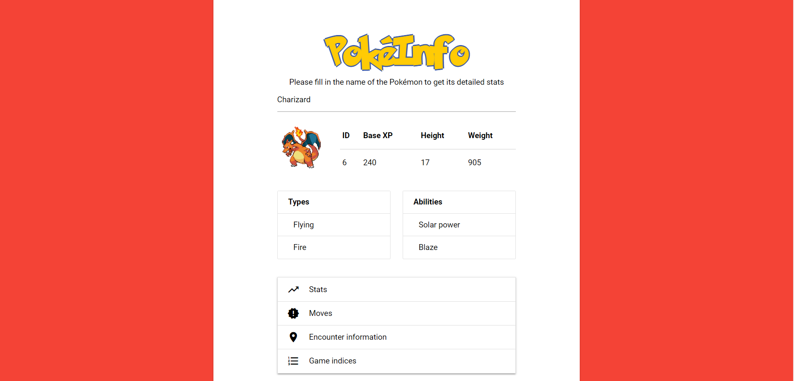
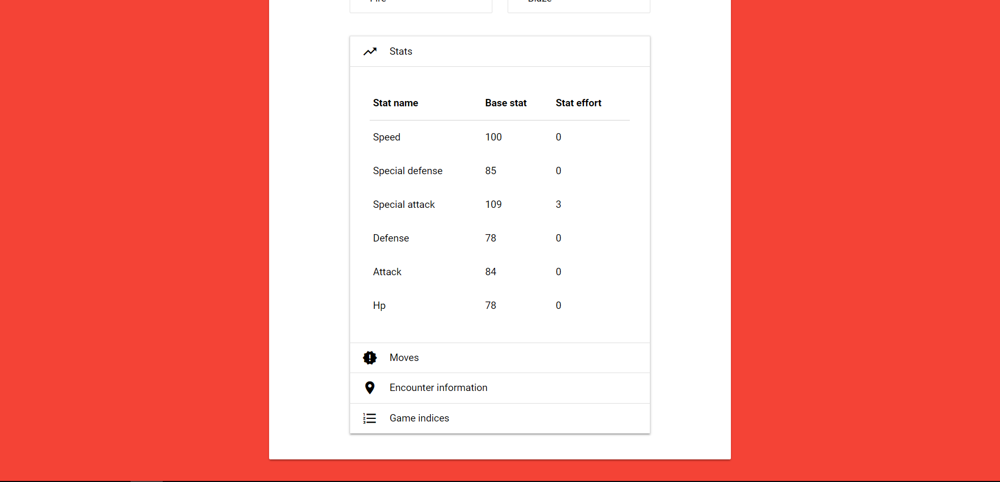

# PokéInfo
An unofficial pokédex made with the PokéAPI and VueJs utilizing Firebase's realtime database as a backend.  
I decided to make this in Vue in order for me to learn a more advanced Javascript framework.  
This application shows you the stats, moves, encounter information and game indices of all the different pokémon.  

## Screenshots
Homepage
  

Pokémon Info Screen  
  

Pokémon Extra Information  
  

## Build Setup
``` bash
# install dependencies
npm install

# serve with hot reload at localhost:8080
npm run dev

# build for production with minification
npm run build
```

For detailed explanation on how things work, consult the [docs for vue-loader](http://vuejs.github.io/vue-loader).
